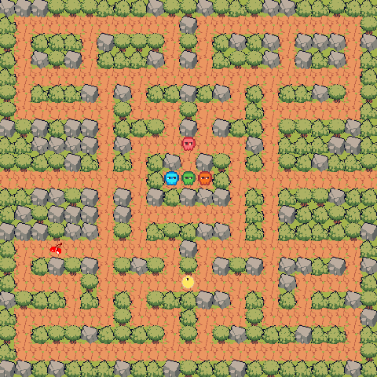

# Pacman

This is a model to simulate Pacman game in GAMA platform using the GAML language.

**You need too install Audio playback extensions of GAMA**

Make sure you have the following extensions installed in your GAMA platform:

- [x] `ummisco.gaml.extensions.sound`
- [x] `ummisco.gama.feature.audio.feature.group`

## Screenshot

_With_ 🧡 _by **FANOMEZANTSOA Herifiandry Marc Nico**_
